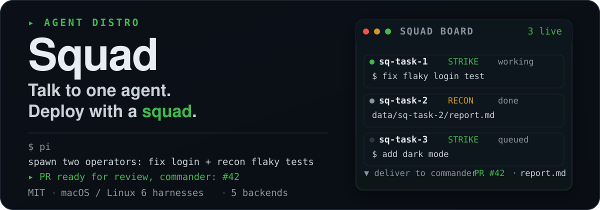
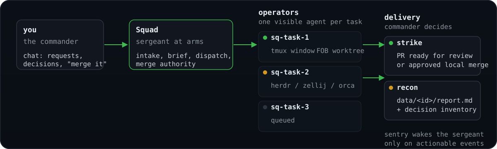

<p align="center">
  
</p>

<p align="center">
  <a href="https://img.shields.io/badge/platform-macOS%20%7C%20Linux-blue?style=flat-square"></a>
</p>

## What it is

Running one coding agent is easy. The moment you want three project tasks done in parallel - fixes, investigations, plans, audits - you become a tab-juggler: babysitting sessions, copy-pasting context between repos, forgetting which terminal had the failing test.

Squad flips the model. You talk to a single agent - the **sergeant at arms** - and it runs the squad for you: spawning visible operators in a session backend, giving each a clean git worktree, supervising them to completion, and handing you finished PRs, approved local merges, or standalone recon reports. For larger units, you can opt in to persistent XOs: operators that run from their own isolated Squad bases on this machine or another SSH-reachable host.

Squad is not a model, not a harness, not a skill, not an MCP server, and not a CLI. Squad is an **agent distro**: a portable directory of instructions, skills, tooling, policies, and state conventions that turns a general-purpose agent into a specialized one. There is no app to install - the cloned repo is the distro (`AGENTS.md`, bundled Squad skills, and helper scripts that any terminal coding agent can follow). Launching a supported harness inside it instantiates your sergeant at arms - and makes you the commander.

## Who it's for

You juggle several projects or repos at once - fixes, investigations, audits - and you're tired of babysitting sessions, copy-pasting context between terminals, and forgetting which repo had the failing test. You want one point of contact that dispatches visible workers, supervises them, and hands you finished PRs and reports.

## Who it's not for

- You want a single agent to be more disciplined and verifiable - that's a per-session concern, not a unit-level one.
- You have one repo and one task at a time.
- You're not ready to set up a harness, GitHub auth, and a session backend.

## How it works

<p align="center">
  
</p>

You chat with the sergeant at arms. It routes each request to an operator in its own session endpoint and git worktree, supervises the unit with a zero-token event-driven sentry, and brings you finished PRs, approved local merges, or recon reports. The sentry sleeps on the unit and wakes the sergeant only when something actually needs you.

Optional XOs extend this to persistent local or whole-base remote XOs; dispatch profiles let you steer which harness handles which task; and opt-in Relay lets the same unit answer public mentions on X and Discord. `codex-app` is not a runtime backend yet - [docs/codex-app-backend.md](docs/codex-app-backend.md) owns that boundary.

Full architecture - the supervision engine, worktree isolation, XOs, dispatch profiles, project modes, optional Relay, unit sync, and self-update - lives in [docs/architecture.md](docs/architecture.md).

## Quick Start

### Requirements

- A verified primary agent harness: Claude Code, Grok, Pi, `pi-signed`, Codex, or OpenCode.
- Git and the GitHub CLI, authenticated through `gh auth login`.
- The CLI and dependencies for your selected runtime backend; tmux is the reference default.

The sergeant at arms detects and offers to install supported missing tools after you approve.

### Install and launch

```sh
gh auth login
git clone https://github.com/runecraftai/squad
cd squad
```

Then launch one of the co-primary harnesses; AGENTS.md takes over from there:

**Claude Code**

```sh
claude
```

**Grok**

```sh
grok --trust
```

**Pi**

```sh
pi
# or, when the signed wrapper is installed
SQUAD_PI_HARNESS=pi-signed pi-signed
```

For Grok, `--trust` is needed once per clone so project hooks and the turn-end guard load; `/hooks-trust` inside Grok works too.
For Pi, approve the project trust prompt once per clone on first launch so the tracked `.pi/extensions/*.ts` files auto-load.
Pi's `/calm` toggle hides supported transcript chrome - including canonically classified Squad operational user rows - and uses a Calm-only animated working-ship indicator during active runs while preserving all model context and session data. The preference persists for the effective Squad base, and toggling it off restores ordinary rendering. [Calm's current behavior and limits](docs/calm.md) are separate from its [version-scoped evidence](docs/calm-mode-feasibility.md).

### Talk to it

```sh
> look at my github project xyz, then fix the flaky login test and add dark mode

# Squad checks its toolchain (asking your consent before installing anything),
# clones the project under projects/ and spawns two isolated operators in the active backend.
# Minutes later:

  PR ready for review, commander: https://github.com/you/xyz/pull/42
  (fix flaky login test - risk: low - CI green)

> alright merge it
```

### More backends

Setup guides for tmux (the default) and every other supported backend (herdr, zellij, Orca, cmux) are linked in [Documentation](#documentation) below.

## Features

- **One point of contact** - you talk only to the sergeant at arms; it dispatches, supervises, escalates only real decisions, and reports plain outcomes.
- **A visible squad** - every operator works in its own tmux window, experimental herdr/zellij tab, cmux workspace, or Orca terminal you can watch or type into; the sergeant at arms reconciles.
- **Disposable worktrees** - each task runs in a clean [FOB](https://github.com/runecraftai/squad/tree/main/packages/fob) (worktree pool) git worktree, or an Orca-managed worktree when `backend=orca`, so parallel work on one repo never collides.
- **Two task shapes** - strike tasks deliver authorized changes; recon tasks leave standalone investigation reports when the intake contract warrants separate research.
- **Explicit project modes** - each project deploys via `drill`, `direct-PR`, or `local-only`, with an optional `+yolo` autonomy flag.
- **Optional XOs** - persistent XOs run from isolated Squad bases with their own `SQUAD_BASE`, state, projects, and session lock, locally or as a whole base on an SSH-reachable host, with guarded updates and recovery that never turns an unavailable remote route into a local replacement.
- **Event-driven, zero-token supervision** - a bash sentry wakes the sergeant at arms only when something needs you; verified primary harnesses also get a turn-end backstop that blocks or follows up on a blind stop when work is under way and supervision is not live.
- **Optional Relay** - opt in with one local `.env` pairing token so Squad can answer your public mentions on X and Discord, act on normal reversible mention requests through the same lifecycle as chat requests, acknowledge spawned work, and post up to three public-safe completion follow-ups within seven days - all without changing non-Relay behavior. A final reply promised in a thread becomes durable state reconciled from disk, so a restart or compacted conversation cannot lose it.
- **Strict project boundary** - the sergeant at arms is read-only over your projects except for the narrow guarded and commander-approved operations authorized by [hard rule 1](AGENTS.md#1-identity-and-prime-directives); operators make every other project change behind the configured merge authority.
- **Restart-proof** - all state lives on disk and in the active session backend (tmux by hard default); kill the session anytime and the next one reconciles - including confirmed-dead XO agents - and carries on.

## Built-in skills

Squad ships these user-invocable built-in skills. Claude and grok use the slash form shown here; codex uses the same names with `$`, such as `$afk`.

| Skill          | What it does                                                                                                                                               |
| -------------- | ---------------------------------------------------------------------------------------------------------------------------------------------------------- |
| `/afk`         | Enter away-mode supervision: the sub-supervisor self-handles routine notifications in bash, escalates commander-relevant events and bounded declared-external-wait rechecks as batched digests, and actively alerts if delivery gets stuck while you step away |
| `/reporting`   | Recap visible session events since the prior real commander message plus visibly unanswered commander decisions, falling back to Sitrep when invoked as the session's first real commander message |
| `/sitrep`      | Generate a concise four-section chat digest from bounded local unit and registered-XO state; use `/sitrep file` to also replace today's dated report in `data/`, and add `include PRs` when live PR enrichment is wanted |
| `/updatesquad` | Self-update the running Squad and its XOs to the latest from origin with fast-forward-only pulls, then re-read instructions and nudge XOs |
| `/debrief`     | Sweep the session for uncaptured durable knowledge, route each finding to its durable owner per AGENTS.md, file undone next steps to the backlog, cascade the same sweep to every registered XO against that base's own memory budget, and report what is now safe to reset |

Sitrep invocation examples:

- `/sitrep` returns the fresh four-section digest in chat only.
- `/sitrep include PRs` keeps chat-only mode and opts into live PR enrichment.
- `/sitrep file` replaces today's `data/status-report-<YYYY-MM-DD>.md` from scratch and links it from the four-section chat digest.
- `/sitrep file include PRs` combines the dated report with live PR enrichment.

Agent-only reference skills live under `.agents/skills/` and are loaded by Squad at the trigger points named in [`AGENTS.md`](AGENTS.md).

### Two-tier skill layout

Squad's skills live in two separate places with different audiences:

- `.agents/skills/` - agent-loaded skills (the table above, plus Squad's agent-only reference skills). Every one assumes a live Squad base and is meaningless - or actively misleading - installed anywhere else, so each carries `metadata.internal: true` in its frontmatter. That flag hides them from installer discovery (tools like the [skills.sh](https://skills.sh) `npx skills add` installer) without affecting how Squad itself loads them.
- `skills/` - public, installer-facing skills meant to be installed standalone into any project, independent of Squad. Today that is `skills/debrief`, a generic session-knowledge-sweep skill that routes findings by explicit instruction first, then existing local conventions, then a private `.debrief-notes.md` fallback in the current directory. It intentionally shares no code with the Squad-internal `.agents/skills/debrief` it is named after, so the two can evolve independently.

## Packages

Squad's tooling ships as standalone packages under `packages/`, each with its own README.

| Package    | What it does                                                                                                        | README                                       |
| ---------- | ------------------------------------------------------------------------------------------------------------------- | -------------------------------------------- |
| drill      | A git push proxy that runs an AI-driven validation pipeline in a disposable worktree and opens a clean PR once every check passes | [README](packages/drill/README.md)   |
| fob        | Manages a pool of reusable, isolated git worktrees so each agent gets a clean environment instantly                  | [README](packages/fob/README.md)             |
| pr-review  | Runs parallel, tiered code review of GitHub pull requests with validated findings and a severity verdict              | [README](packages/pr-review/README.md)       |
| sq-tasks   | Task and backlog manager for agents that edits a hand-editable markdown backlog in place at near-zero token cost     | [README](packages/sq-tasks/README.md)        |
| sq-gh      | GitHub CLI wrapper for agents with token-efficient output, next-step suggestions, and structured errors              | [README](packages/sq-gh/README.md)           |
| sq-browser | Agent-ergonomic browser automation that wraps chrome-devtools-mcp with a token-efficient CLI                        | [README](packages/sq-browser/README.md)      |
| sq-quota   | Reports local Claude, Codex, Cursor, GitHub Copilot, Grok, and Kimi quota windows in one data-only call              | [README](packages/sq-quota/README.md)        |
| sq-report  | Opens agent-generated HTML in a local browser editor so you can annotate elements and send feedback to the agent    | [README](packages/sq-report/README.md)       |

## Documentation

- [docs/architecture.md](docs/architecture.md) - maintainer architecture for the squad, supervision, worktrees, XOs, and project modes.
- [docs/configuration.md](docs/configuration.md) - environment variables, `SQUAD_BASE`, runtime backend selection, optional Relay and its X and Discord setup steps, the files you set, and harness support.
- [docs/remote-XOs.md](docs/remote-XOs.md) - current setup, routing, transfer, recovery, and safety behavior for whole-base remote XOs.
- [docs/calm.md](docs/calm.md) - current Pi `/calm` behavior and supported presentation limits.
- [docs/wedge-alarm.md](docs/wedge-alarm.md) - configure the active alert for an away-mode escalation delivery that gets stuck.
- [docs/tmux-backend.md](docs/tmux-backend.md) - current setup and limits for the tmux reference backend.
- [docs/status-notify.md](docs/status-notify.md) - desktop notifications for operator done/blocked wake events, with a tmux focus action.
- [docs/web-view.md](docs/web-view.md) - a read-only web dashboard of operator state, served over the LAN for viewing from another machine or a phone.
- [docs/herdr-backend.md](docs/herdr-backend.md) - current setup, safety boundaries, and limits for the experimental Herdr backend.
- [docs/zellij-backend.md](docs/zellij-backend.md) - current setup and limits for the experimental Zellij backend.
- [docs/orca-backend.md](docs/orca-backend.md) - current setup and limits for the experimental Orca backend.
- [docs/cmux-backend.md](docs/cmux-backend.md) - current setup, socket security, and limits for the experimental cmux backend.
- [docs/codex-app-backend.md](docs/codex-app-backend.md) - the current blocked Codex App backend boundary and rollout contract.
- [docs/verification/runtime-backends.md](docs/verification/runtime-backends.md) - active maintainer verification for runtime backend guarantees.
- [docs/gitlab-merge-sentry.md](docs/gitlab-merge-sentry.md) - maintainer verification for GitLab merge watching on arbitrary instances.
- [docs/turnend-guard.md](docs/turnend-guard.md) - the primary session's current "no turn ends blind" backstop, scope, loop safety, and compatibility limits.
- [docs/verification/supervision.md](docs/verification/supervision.md) - active maintainer verification for session-start, guard, continuity, and wedge integrations.
- [docs/supervision-protocols/](docs/supervision-protocols/) - rendered primary-harness sentry protocols for Claude, Codex, OpenCode, Pi and `pi-signed`, Grok, and unknown harness fallback.
- [docs/scripts.md](docs/scripts.md) - the `bin/` toolbelt reference.
- [docs/documentation-audiences.md](docs/documentation-audiences.md) - documentation audiences and the machine-checked placement boundary.
- [`AGENTS.md`](AGENTS.md) - the distro's always-loaded operating contract and routing index for conditional procedures.
- [CONTRIBUTING.md](CONTRIBUTING.md) - how to contribute, including the dev/test commands.

## Contributing

Contributions are welcome - see [CONTRIBUTING.md](CONTRIBUTING.md) for the workflow, repo conventions, and how to run the tests.

## License

MIT - see [LICENSE](LICENSE).
