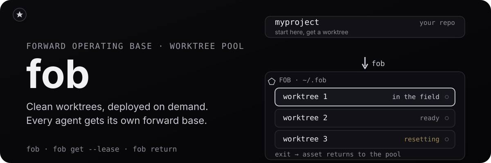

<p align="center">
  
</p>

<h1 align="center">fob</h1>

<p align="center">
  <a href="https://img.shields.io/badge/platform-macOS%20%7C%20Linux%20%7C%20Windows-blue?style=flat-square"></a>
  <a href="https://discord.gg/BW4aJuQhTf"></a>
</p>

<h3 align="center">Manage worktrees without managing worktrees.</h3>

Every agent session needs its own clean copy of the repo.
Clone it fresh each time and you pay for reinstalls and rebuilds every run.
Share one working directory and agents step on each other.
fob keeps a pool of reusable, isolated worktrees per repository, so each agent gets its own environment instantly: no cloning, no conflicts, no coordination overhead.

- **Instant isolation** - `fob` puts you into a clean worktree with zero hassle.
- **Reusable worktrees** - worktrees are preserved in a pool when you're done, dependencies and build cache intact, ready for the next agent.
- **Conflict-free** - automatic detection of in-use worktrees means your agents never step on each other's toes.

## Quick Start

```sh
$ cd myproject                 # start in your repo as usual
$ fob                    # get a worktree and drop into a subshell
🌳 Entered worktree at ~/.fob/myproject-a1b2c3/1/myproject. Type 'exit' to return.

# You're now in an isolated worktree.
# Run your AI agent, make changes, do whatever you need.

$ exit                         # exit the subshell when you're done
🌳 Terminated lingering processes: opencode (pid 12345)
🌳 Worktree returned to pool.
```

## Install

**macOS / Linux**

```sh
curl -fsSL https://raw.githubusercontent.com/runecraftai/squad/main/packages/fob/docs/install.sh | sh
```

**Windows (PowerShell)**

```powershell
irm https://raw.githubusercontent.com/runecraftai/squad/main/packages/fob/docs/install.ps1 | iex
```

**Nix**

```sh
nix build github:runecraftai/squad?dir=packages/fob
# the binary lands in ./result/bin/fob
```

Or add the flake to your inputs:

```nix
fob = {
  url = "github:runecraftai/squad?dir=packages/fob";
  inputs.nixpkgs.follows = "nixpkgs";
};
```

**From source**

```sh
git clone https://github.com/runecraftai/squad.git
cd squad/packages/fob
make install
```

## How It Works

fob manages a **pool of git worktrees** per repository, stored under the configured fob root (default `~/.fob/`).

```
  fob
      │
      ▼
  Find repo root
      │
      ▼
  git fetch origin
      │
      ▼
  ┌───────────────────────────────────────┐
  │  Scan pool for available worktree     │
  │  (not leased, not in-use, not dirty)  │
  └──────────┬────────────────────────────┘
             │
        ┌────┴────┐
        │  Found? │
        └────┬────┘
         yes/ \no
           /   \
          ▼     ▼
   Reset to   Create new worktree
   latest     (detached HEAD at
   default    latest default
   branch     branch)
              & add to pool
          \   /
           \ /
            ▼
  Spawn subshell in worktree
  (agent works here)
           │
           ▼
     exit subshell
           │
           ▼
  Terminate lingering worktree
  processes, reset worktree,
  & return to pool
  (ready for next agent)
```

- **Detached HEAD** - worktrees use detached HEAD mode, reset to whichever of the local or remote default branch is further ahead, so branch name conflicts never happen.
- **No daemon** - all operations are inline CLI commands. Pool state is a small on-disk file, written under a lock by each command.
- **In-use detection** - fob scans running processes and short-lived owner reservations to decide which worktrees are in use. Reservations persist only while `get`, `destroy`, and `prune` lifecycle work is running.
- **Durable leases** - `fob get --lease` reserves a worktree as a persistent home without keeping a process inside it. Each acquisition gets an immutable random lease identity recorded in fob's state. A leased worktree is never handed out by a later `get` and never removed by `prune` until you release it with `fob return`. Unlike process-based detection, a lease survives with zero processes running inside the worktree.
- **State recovery** - fob writes pool state atomically via a temp file and replacement. If an existing state file is empty or truncated, fob warns, rebuilds entries from worktrees still on disk, and marks them leased until you verify them with `fob status`.
- **Dirty detection** - fob treats tracked changes and untracked files as dirty, even when repository config hides untracked files from normal `git status` output.
- **Safe pruning** - `fob prune` removes only idle managed worktrees whose HEAD is already merged into the default branch and whose working tree is clean. It is a dry run unless you pass `--yes`.

## CLI Reference

| Command                    | Description                                          |
| -------------------------- | ---------------------------------------------------- |
| `fob`                | Get a worktree and open a subshell (alias for `get`) |
| `fob get`            | Acquire a worktree from the pool                     |
| `fob get --lease`    | Durably lease a worktree without a subshell; print its path |
| `fob enter <name>`   | Open a subshell in an existing worktree by name (the number from `status`), even if it is in use; pool state is left untouched |
| `fob status`         | Show pool status (highlights leased and current worktrees) |
| `fob return [path]`  | Release any lease, terminate lingering worktree processes, and return it to the pool |
| `fob prune`          | Dry-run removal of stale idle worktrees in the current repo pool |
| `fob prune --all`    | Dry-run removal of stale idle worktrees across every managed pool |
| `fob destroy <path>` | Dry-run removal of one worktree (safe by default; `--yes` to execute) |
| `fob destroy <pool> --all` | Dry-run removal of every disposable worktree in that pool |
| `fob init`           | Create a default `fob.toml` config file        |
| `fob update`         | Update fob to the latest version               |

### Flags

| Command   | Flag      | Description                       |
| --------- | --------- | --------------------------------- |
| `get`     | `--lease` | Durably lease the worktree without opening a subshell; print only its path to stdout |
| `get`     | `--lease-holder` | Optional label recorded as the lease holder (defaults to `$TREEHOUSE_LEASE_HOLDER`) |
| `get`     | `--json` | Print `path`, `lease_id`, `lease_holder`, and `leased_at` as JSON (requires `--lease`) |
| `enter`   | `--print-path` | Print only the worktree's absolute path to stdout instead of opening a subshell (for `cd "$(fob enter --print-path 1)"`) |
| `status`  | `--json` | Print worktree status and lease metadata as JSON |
| `return`  | `--force` | Clean, reset, and return without prompting |
| `return`  | `--if-lease-id` | Return only if the current lease has the expected per-acquisition identity |
| `return`  | `--if-lease-holder` | Return only if the current lease has the expected holder |
| `prune`   | `--yes`   | Delete listed prune candidates instead of doing a dry run |
| `prune`   | `--all`   | Sweep every managed pool under the user-level fob root |
| `prune`   | `--global` | Alias for `--all` |
| `prune`   | `--prune-orphans` | Include backing-repository-missing orphans in prune candidates |
| `prune`   | `--verbose`, `-v` | Show detailed skip diagnostics |
| `destroy` | `--all`   | Remove all worktrees in the named pool (requires a pool path) |
| `destroy` | `--yes`   | Execute the removal instead of doing a dry run |
| `destroy` | `--include-unlanded` | Also remove dirty, unmerged, or unverified worktrees (irreversible data loss) |
| `destroy` | `--include-in-use` | Also remove worktrees with a running process or owner reservation (processes are terminated cleanly first) |
| `destroy` | `--include-leased` | Also remove a leased worktree; only when the exact path is named, never via `--all` |

### Leasing a worktree (no subshell)

`fob get` normally opens an interactive subshell whose lifetime is the hold: when the shell exits, the worktree returns to the pool.
That is awkward for callers that need a worktree to persist as a permanent home with no long-lived process inside it.

`fob get --lease` is the non-interactive, durable alternative:

```sh
path=$(fob get --lease)
# $path is the leased worktree's absolute path; all banners went to stderr.
```

It acquires a worktree exactly like `get`, but instead of opening a subshell it marks the worktree **leased** in fob's persistent state. By default it prints only the worktree's absolute path to stdout; `--json` prints the lease allocation instead. Every human-facing message goes to stderr, so either output mode stays clean.

A leased worktree is never handed out by a later `get` and never removed by `prune`, regardless of whether any process runs inside it, until the lease is explicitly released.
A bulk `fob destroy <pool> --all` never removes it either; only naming its exact path with `fob destroy <path> --include-leased --yes` will.

Pass `--lease-holder <label>` (or set `$TREEHOUSE_LEASE_HOLDER`) to record who holds the lease; `fob status` then shows it next to the `leased` state.

Every acquisition receives a new random `lease_id`, including reacquiring the same path with the same holder. Automation can request a stable machine-readable allocation:

```sh
fob get --lease --lease-holder automation-A --json
# {"path":"...","lease_id":"...","lease_holder":"automation-A","leased_at":"..."}
```

`fob status --json` returns an array with `name`, `path`, `status`, `lease_id`, `lease_holder`, `leased_at`, and `processes`. Non-leased entries use empty lease strings and a `null` timestamp. State files written before lease identities remain readable; their existing leases have an empty `lease_id` until released and acquired again.

Release a lease with `fob return <path>`, which clears the lease, terminates any lingering processes, resets the worktree, and returns it to the pool.
When you pass an explicit path, `fob return` can run from outside the repository because it resolves the managed pool from that worktree path.

For retry-safe automation, condition the return on the identity from allocation or status:

```sh
fob return --force \
  --if-lease-id "$lease_id" \
  --if-lease-holder "$lease_holder" \
  "$path"
```

fob compares supplied conditions while holding the pool state lock. A missing lease or mismatch exits nonzero before process termination, worktree reset, or state clearing. The same lock fences a matching return through the final clear, so the identity succeeds once and cannot release a later acquisition of the same path. `--if-lease-holder` is optional; use `--if-lease-id` for ABA protection when a holder may be reused.

For backward compatibility, `fob return <path>` without either condition keeps its original unconditional path-only behavior. Existing path-only scripts and `fob get --lease` stdout are unchanged.

### Recovering a damaged pool state file

fob writes `fob-state.json` atomically, so a crash mid-write should leave the previous state file intact.
If an existing state file is empty or truncated, commands do not fail just because the JSON cannot be parsed.
They print a warning, rebuild the pool entries from worktree directories still on disk, and mark every recovered entry as `leased` because fob cannot know whether it was idle, in-use, or durably leased.

Run `fob status` to inspect recovered entries.
After verifying a worktree is safe to reuse, run `fob return <path>` to clear the safety lease.
To delete one instead, name its exact path with `fob destroy <path> --include-leased --yes`.
Bulk `destroy --all` and prune leave recovered entries alone.

### Pruning stale worktrees and orphans

`fob prune` is a dry run by default.
By default, it lists stale idle managed worktrees that would be deleted and shows the reclaimable disk space.
Pass `fob prune --yes` to delete those worktrees.

By default, prune only inspects the current repository's pool and must be run inside a git repo.
Pass `fob prune --all` or `fob prune --global` to inspect every managed pool under the user-level fob root from any directory.
Global prune reads the user-level config and hooks, derives each worktree's owning repository from git metadata, then fetches and checks merge safety against that repository.
Without `--prune-orphans`, pass `fob prune --all --yes` to delete only the globally safe stale candidates.

Prune ignores worktrees that are currently in use, leased, or reserved by another lifecycle operation.
It skips idle worktrees that are unsafe to remove and prints the skip reason, such as uncommitted tracked or untracked changes, or a HEAD commit that is not merged into the default branch.
Skip output is grouped by reason so large global sweeps stay scannable.
When `origin` exists, prune fetches it and proves each HEAD against the current remote default branch tracking ref.
Without `origin`, prune uses the local default branch ref.
If `origin` cannot be reached, prune reports `origin unreachable (cannot verify)` and leaves the worktree untouched, even when `--prune-orphans` is set.
If a linked worktree points at a missing backing repository, prune reports `orphaned (backing repository missing)`.
Plain `fob prune` and `fob prune --all` never delete those orphans.
Pass `--prune-orphans` to include true backing-repository-missing orphans in the dry run, then add `--yes` to delete them.
fob cannot verify orphan contents after the backing git metadata is gone, so each orphan candidate is marked `content could not be verified`.
Use `--verbose` to show the underlying git diagnostic details for skipped worktrees.

### Destroying worktrees

`fob destroy` is the deliberate tool for removing a worktree even though it still has unlanded work, but it is safe by default and holds itself to the same bar as `prune`.

Targets are narrow and explicit:

- `fob destroy <worktree-path>` targets exactly one worktree.
- `fob destroy <pool-path> --all` targets worktrees in THAT pool only. The pool path can be the pool directory, a worktree inside it, or the repository (`.` works from inside a repo).

There is no cross-pool or global destroy: `--all` without a pool path is an error, so a stray command can never reach beyond the pool you named.

Destroy is a dry run by default.
It prints a risk-revealing preview - one or more status labels (`[disposable]`, `[leased]`, `[in-use:<pid>]`, `[unmerged]`, `[dirty]`, `[unverified]`, or a comma-separated combination such as `[leased,dirty]`), the path, and the size of each target - and removes nothing.
Pass `--yes` to execute.
It never prints a blind "all worktrees destroyed"; the summary always reports exactly what was destroyed and what was skipped.

A bare `fob destroy <pool> --all --yes` removes only the genuinely disposable set (merged, clean, idle, unleased - the same set `prune` would take) and SKIPS everything else, telling you which flag would include it.
Each risky class is its own opt-in, so removing risky worktrees can never be a reflexive `--yes`:

- `--include-unlanded` also removes worktrees with uncommitted changes, a HEAD not merged into the default branch, or contents fob cannot verify, such as a missing backing repository (irreversible data loss).
- `--include-in-use` also removes worktrees with a running process or owner reservation; their processes are terminated cleanly first and their pids are shown in the preview.
- `--include-leased` also removes a leased worktree, but only when you name the exact worktree path. Leased worktrees are NEVER removed by `--all`; combining `--include-leased` with `--all` is rejected.

A single named worktree that is skipped for lack of a flag makes the command exit non-zero, so scripts notice that nothing happened.
Bulk `--all` skips are normal and exit zero; inspect the summary to see what remains.

#### Migrating from `--force`

The old blunt `fob destroy --force` flag has been removed.
It overrode every protection at once - in-use, unmerged, dirty, and leased - which is what made it dangerous.
Replace it with the specific `--include-*` flag(s) for the risk you actually intend to override, plus `--yes`:

| Old | New |
| --- | --- |
| `fob destroy <path> --force` | `fob destroy <path> --yes` (add `--include-unlanded` / `--include-in-use` / `--include-leased` as needed) |
| `fob destroy --all --force` | `fob destroy <pool> --all --yes` (add `--include-unlanded` for dirty, unmerged, or unverified targets, and `--include-in-use` for in-use targets; leased homes are never included) |

## Configuration

Create a repo config file with `fob init`, or add one manually:

**Repo-level:** `fob.toml` in the repository root

**User-level:** `~/.config/fob/config.toml`

```toml
# Maximum number of worktrees in the pool
max_trees = 16

# Optional worktree root directory.
# Empty uses $HOME/.fob.
# Relative paths are resolved from the repo root for repo-scoped commands.
# Use an absolute user-level root for fob prune --all.
# root = "$HOME/worktrees"
```

The repo-level config takes precedence for repo-safe settings.
`fob prune --all` can run without a repository, so it uses only the user-level config and does not read per-repo `fob.toml` files while sweeping.
If no config is found, the default pool size is 16.

### Hooks

You can run commands automatically at worktree lifecycle points by adding a `[hooks]` section to the user-level config at `~/.config/fob/config.toml`.
Hooks in repo-level `fob.toml` are ignored for safety.
`fob destroy` always reads `pre_destroy` from the user-level config because it can target a pool by path.

```toml
[hooks]
post_create = ["./scripts/setup-venv.sh"]
pre_destroy = ["./scripts/teardown.sh"]
```

- `post_create` runs after a worktree is provisioned or reset and right before `fob get` hands it to you.
  For `fob get --lease`, stdout from `post_create` is routed to stderr so stdout remains the leased path.
- `pre_destroy` runs before a worktree is removed by `fob destroy <path> --yes`, `fob destroy <pool> --all --yes`, or prune deletion commands such as `fob prune --yes` and `fob prune --prune-orphans --yes`.

Commands in each list run sequentially in the worktree directory, via the OS shell (`/bin/sh -c` on Linux/macOS, `%COMSPEC% /c` on Windows).
If a command exits non-zero, fob logs the command, exit code, and stderr, then continues with the remaining commands.
A failing hook does not fail the overall `get`, `destroy`, or `prune` operation.

## Development

```sh
make build          # Build the binary
make test           # Run tests
make lint           # Run gofmt + go vet
make dist           # Cross-compile for all platforms
make install        # Install to $GOPATH/bin or /usr/local/bin
make clean          # Remove build artifacts
```
