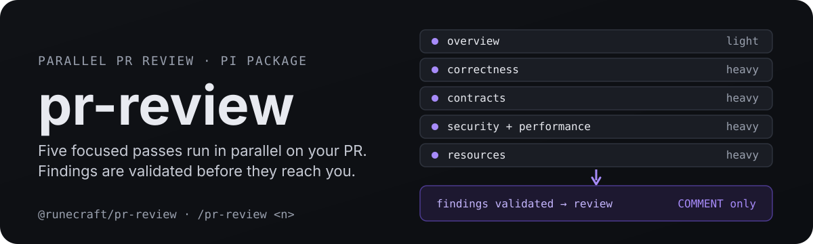

<p align="center">
  
</p>

<h1 align="center">@runecraft/pr-review</h1>

<h3 align="center">Inspect the change before it fires.</h3>

Parallel, tiered code review for GitHub pull requests, built for the [Pi coding agent](https://pi.dev).
You run `/pr-review <n>` and five focused passes go to work at once, on models you choose: an overview plus heavy lenses for correctness, contracts, security and performance, and resources.
Every finding is validated before it is reported, and the result comes back as a structured review with severities (P0 to P3) and a verdict.

- **Parallel by default** - five passes run concurrently, with automatic sharding for very large diffs.
- **Validated findings** - candidates are checked against the diff before anything is reported, so speculation and non-issues stay out.
- **Safe publishing** - reviews post COMMENT-only and never merge or approve. One review `POST` at most, with the first 50 eligible findings inline.

## Install

Installed automatically as part of the harness. Standalone:

    pi install npm:@runecraft/pr-review

## How it works

```
/pr-review 42
     │
     ▼
 fetch PR, capture the diff
     │
     ▼  five passes run in parallel
 overview (light)
 correctness (heavy)
 contracts (heavy)
 security + performance (heavy)
 resources (heavy)
     │
     ▼  findings validated, classified P0-P3
 structured review + verdict
```

The default balanced mode keeps the four heavy lenses on P0 to P2 defects and lets the light overview surface at most three P3 or nit candidates.
`--full` adds a conventions and maintainability pass and lets every pass report all severities; `--major-only` keeps the heavy lenses and skips minor discovery.
The verdict depends only on blocking P0 and P1 findings.

`--comment` and `--no-comment` control whether the completed, validated review is posted back to the PR thread.

## Features

### Live focus viewer

`/pr-review-focus` opens a read-only live focus viewer on the review in progress (`Ctrl+Alt+R`). Return to the main thread without cancelling the review. The viewer never stores the pass objective, input context, or captured diff, and cannot send prompts, steering, or follow-ups.

### Publication

`/pr-review-publish` publishes a completed review's findings and handles that request directly; publishing never starts or reruns a review. When the review was cancelled, it reports that state instead of publishing. With `allowStalePublish: true` the command runs the configured `light` subagent once to reformat the completed output and posts it as a stale review (`/pr-review-publish 123 --allow-stale`). Inline comments are always disabled for stale reviews.

The package caches one validated completed review; `autoPostReviews` and `--comment` publish that cached review after completion. It builds one GitHub review payload and sends at most one review `POST`: the first 50 eligible P0-P3 findings with valid, unique diff anchors are inline, and all other findings that pass content validation stay in the top-level review body.

## Docs

- Full guide, quickstart, and agent matrix: [root README](../../README.md)
- Mental model, and when to use this vs the other tools: [docs/architecture.md](../../docs/architecture.md)
