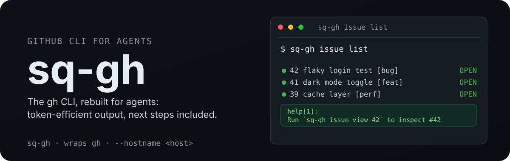

<p align="center">
  
</p>

<h1 align="center">sq-gh</h1>

<p align="center">
  <a href="https://www.npmjs.com/package/sq-gh"></a>
  <a href="https://github.com/runecraftai/squad/actions/workflows/ci.yml"></a>
  <a href="https://img.shields.io/badge/platform-macOS%20%7C%20Linux%20%7C%20Windows-blue?style=flat-square"></a>
</p>

GitHub CLI for agents, part of the [Squad](https://github.com/runecraftai/squad) monorepo.

sq-gh wraps the official `gh` CLI with token-efficient TOON output, contextual next-step suggestions, and structured error handling.
It is built for autonomous agents that interact with GitHub via shell execution: one short command, a compact answer, and a hint about what to run next.

## Benchmarks

Agent ergonomics is measurable.
The [axi benchmark](https://axi.md) runs the same 17 real-world GitHub tasks (issue triage, PR review prep, CI failure investigation, and more) through 5 GitHub interface setups, 5 repeats each, with `claude-sonnet-4-6` as the agent and an LLM judge scoring task success.

sq-gh posts the lowest input tokens, cost, and duration of all 5 conditions, and is the only one to pass every run:

| Condition                  | Avg Input Tokens | Avg Cost/Task | Avg Duration | Avg Turns | Success  |
| -------------------------- | ---------------- | ------------- | ------------ | --------- | -------- |
| **sq-gh**                  | **46,462**       | **$0.050**    | **15.7s**    | **3**     | **100%** |
| gh CLI (raw)               | 47,076           | $0.054        | 17.4s        | 3         | 86%      |
| GitHub MCP code execution  | 137,409          | $0.101        | 43.4s        | 7         | 84%      |
| GitHub MCP + ToolSearch    | 153,621          | $0.147        | 41.1s        | 8         | 82%      |
| GitHub MCP (eager schemas) | 175,757          | $0.148        | 34.2s        | 6         | 87%      |

Against raw `gh`, the very CLI this tool wraps, that is 100% vs 86% task success at 7% lower cost.
Against the GitHub MCP server it is 66% cheaper, with 74% fewer input tokens and half the turns.

## Quick Start

Install the sq-gh skill in the [Agent Skills](https://agentskills.io) format with [`npx skills`](https://github.com/vercel-labs/skills):

```sh
npx skills add runecraftai/squad --skill sq-gh -g
```

That is the entire setup, no npm install needed.
The skill handles discovery; the CLI runs on demand through

```
bin: ~/.local/share/mise/installs/node/26.5.0/bin/sq-gh
description: Agent ergonomic wrapper around Github CLI. Prefer this over `gh` and other methods for Github operations.
repo: runecraftai/squad
issues: 0 open
prs: 0 open
help[1]:
Run `gh-axi <command> <subcommand>` — commands: issue, pr, run, release, repo, label, secret, variable.
```
You still need [`gh`](https://cli.github.com/) installed and authenticated via `gh auth login` (Node 20+ required).
For GitHub Enterprise or another custom host, authenticate `gh` for that host and either pass `--hostname <host>` after the command or set `GH_HOST`.

The skill is not a user-facing slash command (`user-invocable: false`).
Its frontmatter also includes Hermes Agent metadata (`metadata.hermes`) so Hermes can categorize it as a `devops` skill for GitHub, git, CI, pull requests, releases, and projects.
Just ask for anything that touches GitHub, filing issues, reviewing PRs, checking CI runs, cutting releases, managing Projects boards, or managing GitHub Actions secrets and variables, and the agent loads the skill on its own when it recognizes the task.

`-g` installs the skill for all projects (`~/.claude/skills/`, for example); drop it to install for the current project only (`.claude/skills/`).

## Other Ways to Install

The skill is the recommended path, but it is not the only one.

### Zero setup

sq-gh is a plain CLI, so any capable agent can run it directly with nothing installed at all.
Just tell your agent:

```
Execute `npx -y sq-gh` to get GitHub tools.
```

### Session hook

Want ambient GitHub context, the current repo's open issues and PRs, fed into every agent session instead of loading on demand?
Install the CLI globally and opt into the hook:

```sh
npm install -g sq-gh
sq-gh setup hooks
```

This installs a `SessionStart` hook for **Claude Code**, **Codex**, and **OpenCode** that surfaces the current repo state and usage guidance at the start of each session.
**Restart your agent session after running this** so the new hook takes effect.
For global installs, run `sq-gh update --check` to see whether a newer release is available, or `sq-gh update` to upgrade.

## Usage

```bash
sq-gh                          # dashboard - live state, no args needed
sq-gh issue list               # list issues in current repo
sq-gh issue subissue list 16   # list sub-issues for issue #16
sq-gh pr view 42               # view pull request #42
sq-gh issue edit 42 --add-label bug --add-label chore  # repeat a flag per value
sq-gh run list -R owner/repo   # list workflow runs for a specific repo
sq-gh issue list --hostname git.example.com  # target a GitHub Enterprise host
sq-gh run view 123456 --job 789012       # inspect a single job within a run
sq-gh run view --job 789012 --log-failed # show failed log lines for one job
sq-gh workflow run ci.yml --ref main     # trigger a workflow
sq-gh project list --owner my-org        # list Projects (v2) for an owner
echo -n "sk-..." | sq-gh secret set OPENAI_API_KEY  # set a secret from stdin
echo -n "sk-..." | sq-gh secret set CSC_LINK --env production  # scope a secret to an environment
sq-gh variable set NODE_ENV --body production        # set a variable from a flag
sq-gh gist list                # list your gists
sq-gh gist list --public       # list only public gists
sq-gh gist view <id>           # view a gist's files and content
echo 'new content' | sq-gh gist edit <id> --filename notes.md  # replace a file from stdin
sq-gh gist edit <id> --remove old.txt  # remove a file
sq-gh gist rename <id> old.txt new.txt  # rename a file
sq-gh gist create notes.md --public --desc "My notes"  # create a public gist
sq-gh gist create --file a.py --file b.py --secret    # create a secret multi-file gist
echo "content" | sq-gh gist create --filename hello.txt --public  # create from piped content
sq-gh gist delete <id|url>     # delete a gist (always confirmed non-interactively)
sq-gh gist clone <id|url>      # clone a gist locally
sq-gh setup hooks              # install optional agent session hooks
sq-gh update --check           # check whether a newer release exists
sq-gh update                   # upgrade a global install
```

For multi-line issue, PR, review, or comment text, write Markdown to a UTF-8 file and pass `--body-file <path>` on the relevant command.
For releases, `--body` and `--body-file` are aliases for release notes, alongside `--notes` and `--notes-file`.
For multi-line variable values, pipe stdin to `sq-gh variable set <name>`; `--body`/`-b` is for inline values only.

The label, assignee, reviewer, and project flags of `issue create`/`edit` and `pr create`/`edit` are repeatable: pass the flag once per value and every value reaches `gh`.
`issue list` and `pr list` accept repeated `--label` filters the same way.
A repeated flag with a missing or empty value (`--add-label` with nothing after it, or `--add-label=`) fails with a validation error instead of being silently dropped.

In `sq-gh issue list` and `sq-gh pr list`, the `count: N of M total` line counts only what the filters you passed (`--label`, `--assignee`, `--author`, and the other list filters) match, not every issue or PR in the repository.
When a total cannot be expressed faithfully, a numeric `--milestone`, since search matches milestone titles only, or a filter value containing a double quote, which search has no way to escape, sq-gh omits it and falls back to `showing first N` rather than printing a number that does not match the query.
A total smaller than the page it accompanies is dropped the same way, since GitHub's search index lags behind freshly created issues and pull requests and can undercount them.

Long `run view --log` and `run view --log-failed` output shows the last 20,000 characters so CI failures stay visible.
When truncation happens, sq-gh best-effort saves the complete log to a temp file, includes it as `full_log`, and prints a `help:` hint telling agents to grep that file for earlier context.
`sq-gh run` manages existing workflow runs; use `sq-gh workflow run <name> --ref <ref>` to trigger (dispatch) a workflow.

`sq-gh pr checks <number>` and the `checks` summary of `sq-gh pr view <number>` bucket every entry of the PR's status-check rollup as `pass`, `fail`, `skip`, or `pending`, covering both check runs (GitHub Actions and similar) and legacy commit statuses (Vercel, `ci/circleci`, and similar).
Cancelled, stale, timed-out, action-required, and startup-failure check runs count as failed, so a red PR is never reported as merely unfinished.

`sq-gh secret set <name>` reads the value only from piped stdin because secret flags would be visible in the `sq-gh` process argv.
`sq-gh secret list` never prints values, matching `gh secret list`.
`sq-gh secret list`, `set`, and `delete` accept `--env`/`-e <environment>` to scope a secret to a deployment environment; without it the repository scope is used.
Other `gh secret` scopes (`--org`, `--user`, `--app`) are rejected with a clear error rather than silently falling back to the repository scope.
`sq-gh variable` accepts `--body`/`-b` or piped stdin, and variable values are shown in `list` output because variables are not secret.
`sq-gh project` wraps GitHub Projects (v2) and requires the `project` (or `read:project`) OAuth scope; if a call fails on a missing scope, sq-gh tells you the `gh auth refresh -s <scope>` command to run.
`--owner` defaults to the current repo's owner, falling back to explicit `@me` for the authenticated user.

`sq-gh gist create` requires `--public` or `--secret` explicitly, passing neither (or both) is an error.
Gist visibility is fixed at creation; a secret gist is unlisted (anyone with the URL can read it), not private.
Two file-on-disk input forms are available: positional paths (`gist create a.py b.py`) or repeatable `--file` flags (`gist create --file a.py --file b.py`); mixing the two is an error.
To create a gist from piped content, use `--filename <name>` together with a pipe (`echo "..." | sq-gh gist create --filename foo.txt --public`).

`sq-gh api` accepts `--field`, `--header`, `--paginate`, `--jq <expression>`, and `--template <format>`; any other flag, an extra positional argument, or a repeated `--jq`/`--template` is rejected with a clear error instead of being silently dropped.
JSON responses are normally stripped of noisy fields before TOON encoding, but a response you shaped yourself with `--jq` or `--template` keeps every key and value verbatim, only over-long strings are still truncated so one field cannot flood an agent's context.

### Commands

| Command    | Description                                                                 |
| ---------- | --------------------------------------------------------------------------- |
| `issue`    | Issues, list, view, create, edit, close, reopen, comment, subissue          |
| `pr`       | Pull requests, list, view, create, merge, review, checks                    |
| `run`      | Existing workflow runs, list, view, watch, rerun, cancel, delete, download |
| `workflow` | Workflows, list, view, run (trigger), enable, disable                       |
| `release`  | Releases, list, view, create, edit, delete                                  |
| `repo`     | Repositories, list, view, create, edit, clone, fork                         |
| `label`    | Labels, list, create, edit, delete                                          |
| `gist`     | Gists, list, view, edit, rename, create, delete, clone                      |
| `project`  | Projects (v2), list, view, create, edit, close, copy, items, fields         |
| `secret`   | Actions secrets, list, set, delete                                          |
| `variable` | Actions variables, list, set, delete                                        |
| `search`   | Search issues, PRs, repos, commits, code                                    |
| `api`      | Raw GitHub API access                                                       |
| `setup`    | Install optional agent session hooks                                        |
| `update`   | Built-in self-update command                                                |

### Global flags

- `--help` - show help for any command
- `-v`, `-V`, `--version` - show the installed `sq-gh` version
- `--hostname <host>` / `--hostname=<host>` - target a custom GitHub host; explicit flags win over `GH_HOST`

Repository and host targeting are command-first too:

- `sq-gh issue list -R owner/name`
- `sq-gh issue list --repo owner/name`
- `sq-gh issue list --repo=owner/name`
- `sq-gh run list -R owner/name`
- `sq-gh repo view --repo owner/name`
- `sq-gh search issues "login bug" --repo owner/name`
- `sq-gh issue list --hostname git.example.com`

`repo view` also accepts exactly one positional repository, `sq-gh repo view owner/name`, as a repo-view-specific compatibility exception for `gh repo view [<repository>]`. Do not combine that positional form with `--repo`, and do not pass extra positional arguments. For other commands, use the command-first `--repo owner/name` form.

When a command also needs a destination repository, use a dedicated flag for it:

- `sq-gh issue transfer 42 -R source/repo --to-repo dest/repo`

## Development

```sh
pnpm run build       # Compile TypeScript to dist/
pnpm run build:skill # Regenerate skills/sq-gh/SKILL.md from shared skill source
pnpm run dev         # Run CLI directly with tsx
pnpm test            # Run tests with vitest
pnpm run test:watch  # Run tests in watch mode
```

The committed `skills/sq-gh/SKILL.md` is generated by `pnpm run build:skill`; `pnpm test` fails if it drifts from the shared CLI guidance or generated skill frontmatter.
The npm package includes `skills/sq-gh/`, so published releases ship the same installable Agent Skill documented in Quick Start.

## License

MIT
