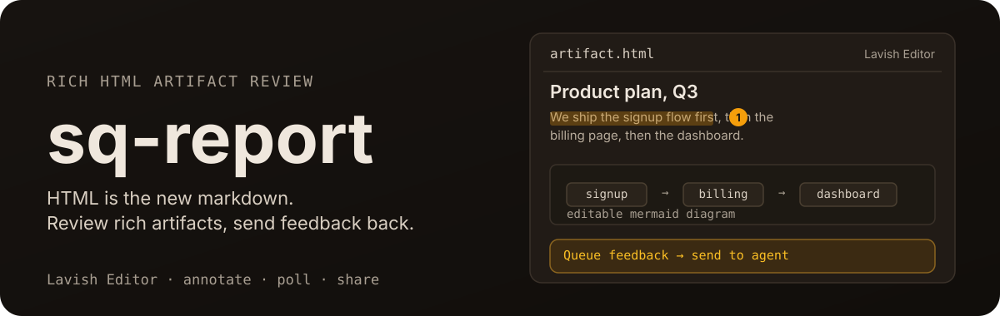

<p align="center">
  
</p>

<h1 align="center">sq-report</h1>

<p align="center">
  <a href="https://www.npmjs.com/package/@runecraft/report"></a>
  <a href="https://github.com/runecraftai/squad/actions/workflows/ci.yml"></a>
  <a href="https://img.shields.io/badge/platform-macOS%20%7C%20Linux%20%7C%20Windows-blue?style=flat-square"></a>
</p>

<h3 align="center">sq-report: for when a rich editor is not rich enough.</h3>

```text
Agent writes artifact.html
        │
        ▼
sq-report <file> opens it in the browser
        │
        ▼
Commander annotates and edits
        │
        ▼
sq-report poll returns the feedback
        │
        ▼
Agent applies the changes
```

HTML is the new markdown. sq-report is the new editor for your HTML artifacts, packaged as the `sq-report` CLI in the [Squad](https://github.com/runecraftai/squad) monorepo.

Agents are good at producing rich HTML artifacts, but the human-agent collaboration loop on such artifacts is lacking and falls back into screenshots and long responses for "tell me what to change."
That loses the thing HTML is best at: interactivity.

sq-report opens agent-generated HTML files in a local browser, lets you pinpoint elements and selected text, edit rendered Mermaid diagrams as whiteboards, and send feedback to the agent to address.

- **Local-first** - Review local HTML artifacts with a local CLI and no cloud dependency in the core feedback loop; hosted sharing through third-party ht-ml.app is explicit and opt-in.
- **Human-AI collaboration** - Annotate elements and selected text ranges, edit Mermaid diagrams as whiteboards, and send messages to the agent without leaving sq-report.
- **Battery included** - sq-report teaches your agent good visualization for common use cases such as product or technical plans, design explorations and more out of the box.

sq-report is a plain CLI any capable agent can run without setup.
It is optimized for agent ergonomics: TOON output, long polling, and contextual disclosure make it highly token efficient.
The skill and hooks below only handle discovery; agents learn to use the CLI by using it.

## Quick Start

Install the `lavish` skill in the [Agent Skills](https://agentskills.io) format with [`npx skills`](https://github.com/vercel-labs/skills):

```sh
npx skills add runecraftai/squad --skill lavish
```

That is the entire setup, no npm install needed.
The skill handles discovery; the CLI runs on demand through `npx -y @runecraft/report <html-file>`.
The full generated skill text is committed as `skills/lavish/SKILL.md`, rendered from the CLI's no-args home output by `scripts/build-skill.js`, so it always matches the live guidance - read that file or run `sq-report` with no arguments for the current content.
In restricted subprocess sandboxes, CI, or agent harnesses where `npx -y` exits opaquely, the skill also documents direct installed-copy fallbacks through the local or global npm install path.
Its frontmatter also includes Hermes Agent metadata, so Hermes-compatible harnesses can categorize and surface it as a first-class productivity skill.
This installs the public `lavish` skill.
The repository also contains an internal `sq-report-design` brand skill for maintainers; default `npx skills add ... --list` and skills.sh discovery hide it unless `INSTALL_INTERNAL_SKILLS=1` is set.

Then, in agents that expose skills as slash commands (Claude Code, for example), invoke it directly:

```
/lavish let's discuss our plan here
```

Or just ask for anything that is easier to grasp visually, a plan, comparison, diagram, table, code view, or report, and the agent loads the skill on its own when it recognizes the task.

By default the skill lands in the current project's skills directory (`.claude/skills/`, for example); add `-g` to install it for all projects (`~/.claude/skills/`).

## Other Ways to Use sq-report

The skill is the recommended path, but it is not the only one.

### Zero setup

sq-report is a plain CLI, so any capable agent can run it directly with nothing installed at all.
Just tell your agent:

```
Use `npx -y @runecraft/report` to write a product or technical plan for what we discussed.
```

### Session hook

Want sq-report's ambient context, including your live open sessions, fed into every agent session instead of loading on demand?
Install the CLI globally and opt into the hook:

```sh
npm install -g @runecraft/report
sq-report setup hooks
```

This installs a `SessionStart` hook for **Claude Code**, **Codex**, **OpenCode**, and **GitHub Copilot CLI** that surfaces open sessions, visualization playbooks, and usage guidance at the start of each session.
Unlike the skill, the hook also shows your live open sessions, so a fresh agent session can resume an in-flight review.
**Restart your agent session after running this** so the new hook takes effect.

### Agent Plugin

sq-report also ships as an [Agent Plugin](https://agent-plugins.org), the vendor-neutral packaging standard for skills and MCP servers, so clients that speak that format can load it directly.

**No marketplace is involved.** The installed npm package _is_ the plugin: `plugin.json` sits at the package root next to the `skills/` directory, so whatever `npm install` already put on disk is a complete, conformant plugin. Install the CLI, then register it:

```sh
npm install -g @runecraft/report
sq-report setup plugin
```

That registers the installed package with every supported client it finds, **VS Code**, **Cursor**, and **GitHub Copilot CLI**, and reports which ones were absent. It is opt-in and idempotent, and it repairs the registered path after a reinstall or relocation. Reload each client afterward.

Each client is registered independently: one that cannot be registered is reported with what to do about it, and never blocks the others or fails the command.

To register by hand instead, point any client at the package directory (`npm root -g`/`@runecraft/report`):

| Client             | Register with                                                                                                 |
| ------------------ | ------------------------------------------------------------------------------------------------------------- |
| VS Code            | `"chat.pluginLocations": { "<package-dir>": true }` in user settings                                          |
| Cursor             | link the package dir at `~/.cursor/plugins/local/report` (`setup plugin` handles Windows link compatibility)  |
| GitHub Copilot CLI | `copilot plugin install <package-dir>` (or `copilot plugin install runecraftai/squad` straight from the repo) |

Codex and ChatGPT install plugins only from marketplace sources, so Codex users should use the session hook above instead.
sq-report declares no MCP server; the CLI itself is the agent interface, so a plugin install brings the same `lavish` skill, and the skill and plugin are alternatives rather than a stack.

### From source

```sh
git clone https://github.com/runecraftai/squad.git
cd squad/packages/sq-report
pnpm install --frozen-lockfile
pnpm run build
pnpm link
```

## How It Works

```
┌───────────────┐
│ Agent writes  │
│ artifact.html │
└───────┬───────┘
        ▼
┌────────────────────────┐
│ sq-report <file_path>  │
│ opens local browser UI │
└───────┬────────────────┘
        ▼
┌────────────────────────┐
│ Human annotates text   │
│ or elements, sends     │
│ chat, or queues layout │
│ issues from the inbox  │
└───────┬────────────────┘
        ▼
┌────────────────────────┐
│ sq-report poll waits   │
│ and returns prompts    │
│ the user queued        │
└────────────────────────┘
```

- **File-path identity** - Sessions are keyed by the canonical HTML file path, so agents do not need opaque IDs.
- **Portable artifacts** - The artifact runs in an iframe while sq-report injects a small SDK for annotations, snapshots, feedback controls, and render-time layout checks.
  sq-report does not inject any design system, so the saved HTML file renders identically whether you open it through `sq-report` or directly in a browser.
  Run `sq-report design` for the single source of agent-facing design guidance and optional CDN or Mermaid snippets.
  Run `sq-report new <kind> [--tokens <kit>]` to scaffold a ready-made starter artifact you then edit: it ships with a painted page background, the layout-safety CSS, a design-system choice, and playbook-aligned snippets (decision queuePrompt form, comparison cards, table, plan, code via @pierre/diffs, Mermaid diagram, slides).
  Kinds mirror the playbooks (`base`, `decision`, `comparison`, `table`, `plan`, `code`, `diagram`, `slides`); token kits are `daisyui` (default, CDN runtime), `shadcn` (Tailwind browser runtime), and `sq-report` (self-contained compiled CSS that renders fully offline).
- **Self-paint warning** - `sq-report <html-file>`, `export`, and `share` run a render-free check for artifacts missing an explicit page background and return a one-line `self_paint_warning`.
  The check fails open: any stylesheet link, `@import`, Tailwind runtime script, `color-scheme`, or `html`/`body`/`:root` background signal suppresses it, and it never blocks the open.
- **Open-time layout gate** - The browser chrome masks an artifact only while the real in-iframe audit waits for fonts and final geometry.
  The first completed check always reveals the artifact, whatever it found; the gate never holds the review hostage waiting for a repair.
  The user can click **Show anyway**, and a bounded safety timeout fails open when no check has completed.
- **Layout issues inbox** - Detection is passive. After fonts and finite animations settle, the injected SDK confirms severe failures from direct rendered evidence such as materially escaped meaningful content or required controls, clipped text fragments, viewport reachability, or near-total semantic occlusion.
  Explicit ellipsis and line clamp, standard visually hidden accessibility text, intentional scrollers or masks, parent overhang, generic element scroll geometry, decorative overlap, and uncertain motion do not produce findings by themselves.
  Proven failures are filed in a **Layout issues** button in the top bar, which is hidden while nothing is unresolved and otherwise shows the unresolved count.
  Its drawer lists each issue with severity, a plain-language explanation, the affected viewport, the target/component identity, when it was last seen, and its lifecycle state, plus per-issue **Reveal** (highlight it in the artifact) and **Dismiss** actions.
  Nothing is selected by default. The user picks issues (or **Select all**) and **Queue selected fixes** turns that whole group into one ordinary queued prompt, tagged `layout-warnings`, that reaches the agent through the normal feedback path when they send.
  Detection never returns `sq-report poll` and never wakes an agent; only the user queueing a fix does. The one exception is a fatal `artifact_failures` response, for failures that make the review itself unusable, such as the artifact document or one of its own local assets failing to load.
- **Layout issue lifecycle** - Each issue is identified by a stable fingerprint of the diagnostic rule, the normalized target identity, and the viewport class, so repeat detections update one record instead of inflating the count.
  `Open` means the latest completed check for its viewport still detects it. `Queued for fix` means the user asked for a repair; it stays unresolved and counted, and cannot be queued again while that request is outstanding.
  `Resolved` requires a newer successful artifact load plus a complete check at the same viewport that no longer detects it; it then leaves the count but keeps a bounded history.
  `Still present` (recurring) means a queued issue survived a newer revision, so it is selectable again with its earlier attempt retained. `Unverified` means a reload or check failed or was incomplete, so the prior issue was preserved rather than cleared. `Returned` means a resolved issue came back on a later revision.
  Dismissal applies only to the current artifact revision; a later revision surfaces the issue again if it is still detected. A check at one viewport never clears an issue found at another, and a viewport removed from the configured diagnostic set (`SQ_REPORT_DIAGNOSTIC_VIEWPORTS`, default all) is marked obsolete with an explicit reason rather than reading as fixed.
- **Local assets** - Copy local images, CSS, fonts, and scripts next to the HTML artifact and reference them with relative paths from that directory; root-prefixed paths such as `/assets/logo.png` will not resolve through sq-report's artifact route.
- **Export and sharing** - `sq-report export` writes `<name>.export.html` by inlining local assets only, stripping the annotation SDK, and leaving remote CDN/font references as links that still need network access.
  `sq-report share` publishes the same local-inlined HTML to [ht-ml.app](https://ht-ml.app), a third-party hosting service not part of sq-report.
  Publishing sends the artifact to ht-ml.app's servers, public by default, or private and password-protected with `--password`; the response includes a secret `update_key` shown once for later management.
  Bundling never fetches remote URLs, sq-report itself does not set a CSP, local reads stay confined and size-capped, and absolute `file://` paths outside safe inlined asset references are redacted before output.
  Per-asset and per-bundle inline caps default to 10 MB and 25 MB, overridable with `SQ_REPORT_EXPORT_MAX_ASSET_BYTES` and `SQ_REPORT_EXPORT_MAX_BUNDLE_BYTES`.
  Unresolved local assets or export notices such as author-set CSP meta tags and redacted file URLs are surfaced in command or browser output.
  Use `--token` or `SQ_REPORT_HTML_APP_TOKEN` for an optional bearer token; set `SQ_REPORT_HTML_APP_API_URL` only when overriding the ht-ml.app API base.
- **Live reload** - sq-report watches the HTML artifact file by default and preserves review context across reloads: the artifact iframe scroll position, an open annotation card's unsent text, and answers to `data-lavish-question` controls (application-owned form state is left alone). While a queued layout-issue batch is outstanding, closely spaced saves coalesce so one batch of fixes costs one refresh. To also reload on sibling asset changes, add `data-lavish-live-reload-root` to the root element or `<meta name="lavish-live-reload" content="root">`.
- **Feedback controls** - Native controls (radios, checkboxes, inputs, selects, buttons, labels, disclosure summaries, contenteditable) are interactive automatically, so they do not need `data-lavish-action`.
  For reversible choices, let option clicks update local state, then queue exactly one final answer from a per-question submit or Queue answer button with `window.lavish.queuePrompt()`.
  Mark only custom (non-native) clickable elements with `data-lavish-action` so sq-report does not annotate them, and use `data-lavish-question` or `queueKey` when pre-send updates for the same question should replace each other.
  Queued annotation preview pills and chat history share a scrollable Conversation panel above a sticky composer, so long feedback queues do not push the text box or send controls off screen.
  The browser chrome keeps editing actions in the overflow menu (copy path, reload artifact, copy DOM snapshot, export standalone HTML, publish link, end session), while the composer exposes **Send & End** beside **Send to Agent** to submit queued prompts and user-ended attribution together.
- **Keyboard shortcuts** - In the chrome composer, Enter sends queued prompts and Shift+Enter inserts a newline.
  In the annotation card, Enter queues the annotation, Shift+Enter inserts a newline, and Ctrl+Enter (Cmd+Enter on macOS) queues it and sends all queued prompts immediately.
  Cmd+I or Ctrl+I toggles between annotate and explore mode from either the browser chrome or the artifact iframe, including while focus is in a textarea or control.
- **Agent presence** - The browser shows when no agent is listening, keeps queued feedback for the next successful `sq-report poll` send even across reloads, and only blocks human sends while the agent is working on delivered feedback; the agent's reply (`--agent-reply`) concludes that work and re-enables sends.
  The no-timeout poll always writes an immediate stderr banner so it is visibly not hung; it adds the periodic stderr wait ticks only in an interactive terminal, so when stderr is piped (as under agent harnesses) the captured output carries no tick noise. Stdout always stays reserved for the final response; if the poll is interrupted or times out, re-run it because queued feedback is never lost.
  Codex-specific guidance keeps that poll attached to the active turn instead of hiding it in a background task, because completed background tasks may not resume the agent.
- **Session end etiquette** - sq-report tracks who ended a session: a human clicking **End session** (or **Send & end session**) in the browser is a user-initiated end, while `sq-report end <html-file>` is agent-initiated.
  A plain `sq-report <html-file>` after a user-initiated end refuses to reopen the browser and returns guidance instead; pass `--reopen` only when the user asks for further review or something important needs their visual attention.
  Agent-initiated ends keep reopening normally, same as before.
  `sq-report poll`'s `ended` response and the `feedback` response for the final batch before an end both carry `next_step` guidance telling the agent to stop polling and deliver remaining updates in chat instead of reopening.
- **Precise targets** - Text annotations include selected text plus range anchors, so agents are not limited to whole-element selectors.
- **Mermaid diagrams** - In the sq-report browser, every rendered Mermaid diagram in a `.mermaid` container becomes an embedded editable Excalidraw whiteboard.
  Click a diagram to unlock editing, and use its Fullscreen action to edit it over the whole viewport.
  Whiteboard scenes autosave locally.
  If a live reload changes the Mermaid source, the whiteboard shows that its edits are stale; reopening it lets the reviewer re-convert and discard the saved edits or keep editing the saved scene.
  Use **Queue feedback** to add a bounded edit summary plus local `.excalidraw` scene and PNG preview paths to the Conversation panel, then click **Send to Agent** to deliver it.
  The agent updates the artifact's Mermaid source, which remains authoritative.
  Flowchart, sequence, class, ER, and state diagrams convert to editable shapes; other diagram types are images that reviewers can draw and annotate.
  sq-report changes only the browser view, so saved, standalone, and exported artifacts still render plain Mermaid.
- **Server cleanup** - The detached server stops after the last session ends when nothing is connected, or after `SQ_REPORT_IDLE_TIMEOUT_MS` (default 30 minutes) with no browser or poll connections.
  Set `SQ_REPORT_IDLE_TIMEOUT_MS=0` or `off` to disable idle self-shutdown.
- **Local-first state** - Session state stays under `~/.sq-report/` by default, or `SQ_REPORT_STATE_DIR` when set.
- **Diagnostic viewports** - `SQ_REPORT_DIAGNOSTIC_VIEWPORTS` sets which viewport classes the layout-issue inbox tracks (`mobile`, `compact`, `desktop`; comma-separated, default all). Warnings whose class leaves the set are marked obsolete with an explicit reason instead of silently reading as fixed.
- **Server port** - Set `SQ_REPORT_PORT` to choose the server port; it defaults to `4387`.
- **Network binding** - The server binds to loopback (`127.0.0.1`) by default. Set `SQ_REPORT_HOST` to bind elsewhere; a wildcard (`0.0.0.0` or `::`) binds every interface. Binding beyond loopback exposes an unauthenticated server that can read and serve arbitrary local files to anything that can reach it, so only do so on a trusted network. Set `SQ_REPORT_LINK_HOST` to control the hostname written into generated session links (defaults to the bind address, or loopback when bound to a wildcard).
- **Allowed hosts** - To defend against DNS rebinding, the server rejects (`403`) any request whose `Host` header is missing or not one it answers to: the loopback names (`127.0.0.1`, `::1`, `localhost`) plus the configured bind and link host. If you reach the server under another name, a wildcard bind accessed by LAN IP, a reverse-proxy hostname, or an extra interface, list those names in `SQ_REPORT_ALLOWED_HOSTS` (whitespace-separated) to allow them. Behind a reverse proxy, the forwarded `X-Forwarded-Host` is validated against the same list, so add your public hostname there and have the proxy send it. Set `SQ_REPORT_ALLOWED_HOSTS` to `*` to disable the check entirely (only when the server sits behind your own authentication or proxy).
- **Browser opening** - Set `SQ_REPORT_NO_OPEN=1`, equivalent to `--no-open`, to create or resume a session without launching a browser window.

## CLI Reference

| Command                        | Description                                                                                                                                                                                                                                                                                                                                  |
| ------------------------------ | -------------------------------------------------------------------------------------------------------------------------------------------------------------------------------------------------------------------------------------------------------------------------------------------------------------------------------------------- |
| `sq-report`                    | Show current sessions and usage guidance.                                                                                                                                                                                                                                                                                                    |
| `sq-report update`             | Check for or apply the latest npm release through the AXI SDK self-updater.                                                                                                                                                                                                                                                                  |
| `sq-report <html-file>`        | Open or resume a sq-report session, with the open-time layout gate enabled by default. Unresolved layout issues from earlier in the session are preserved. Refuses to reopen a session the user explicitly ended from the browser unless `--reopen` is passed.                                                                               |
| `sq-report poll <html-file>`   | Long-poll until the user sends feedback or ends the session; detected layout issues wait in the user's Layout issues inbox and arrive only when queued. Leave no-timeout polls running, or re-run them if interrupted. Codex guidance keeps polls attached to the active turn. On `status: ended`, stop polling and do not reopen uninvited. |
| `sq-report end <html-file>`    | End a session as the agent; unlike a user-initiated end from the browser, this still allows a plain reopen later.                                                                                                                                                                                                                            |
| `sq-report export <html-file>` | Write a portable copy of the artifact: one HTML file with its local assets inlined, so it opens with no server and no sibling files. Remote CDN/font references are left as links.                                                                                                                                                           |
| `sq-report share <html-file>`  | Publish the artifact (local assets inlined) to [ht-ml.app](https://ht-ml.app), a third-party host not part of sq-report, and print a visitable URL plus a secret update key; shares are public by default, and `--password` makes viewers enter the password before viewing.                                                                 |
| `sq-report stop`               | Shut down the background server.                                                                                                                                                                                                                                                                                                             |
| `sq-report playbook [id]`      | List focused artifact guidance or show one playbook; agents must open each matching playbook before writing HTML.                                                                                                                                                                                                                            |
| `sq-report design`             | Show agent-facing design guidance, including optional CDN and Mermaid snippets and the starter-template list.                                                                                                                                                                                                                                |
| `sq-report new <kind>`         | Scaffold a ready-made starter artifact you then edit: painted page background, layout-safety CSS, design tokens, and playbook-aligned snippets. Kinds: `base`, `decision`, `comparison`, `table`, `plan`, `code`, `diagram`, `slides`; `--tokens` picks a token kit and `--out` the output path.                                             |
| `sq-report setup hooks`        | Install or repair optional SessionStart hooks for Claude Code, Codex, OpenCode, and GitHub Copilot CLI; restart the agent session afterward.                                                                                                                                                                                                 |
| `sq-report setup plugin`       | Register the installed package as an [Agent Plugin](https://agent-plugins.org) in VS Code, Cursor, and GitHub Copilot CLI; opt-in, idempotent, no marketplace involved. Reload each client afterward.                                                                                                                                        |
| `sq-report server`             | Run the local sq-report server.                                                                                                                                                                                                                                                                                                              |

Known playbook IDs: `diagram`, `table`, `comparison`, `plan`, `code`, `input`, `slides`.
One artifact often combines several playbooks, such as a plan that includes a comparison and a diagram, so agents must match against each `use_when` trigger and open every matching playbook before writing HTML.
For flows, architecture, state, or sequence diagrams, open the diagram playbook for the recommended tooling and SVG guidance.

### Flags

| Command                 | Flag                  | Description                                                                                                                                                                                                                      |
| ----------------------- | --------------------- | -------------------------------------------------------------------------------------------------------------------------------------------------------------------------------------------------------------------------------- |
| `sq-report <html-file>` | `--no-open`           | Ensure the server/session exists without opening another browser window.                                                                                                                                                         |
| `sq-report <html-file>` | `--no-gate`           | Skip the open-time layout curtain for this browser open.                                                                                                                                                                         |
| `sq-report <html-file>` | `--reopen`            | Reopen a session the user explicitly ended from the browser; without it, a plain open refuses and explains why instead of reopening uninvited.                                                                                   |
| `sq-report update`      | `--check`             | Report current vs latest npm version without installing an update.                                                                                                                                                               |
| `sq-report export`      | `--out <path>`        | Write the export to a specific path instead of `<name>.export.html` next to the source.                                                                                                                                          |
| `sq-report share`       | `--password <pw>`     | Make the third-party ht-ml.app page private; viewers must supply the password.                                                                                                                                                   |
| `sq-report share`       | `--token <t>`         | Attach an optional bearer token (`SQ_REPORT_HTML_APP_TOKEN`); never required to publish.                                                                                                                                         |
| `sq-report poll`        | `--agent-reply "..."` | Show the agent's reply in the existing browser chat and re-enable human sends before polling again.                                                                                                                              |
| `sq-report poll`        | `--timeout-ms <ms>`   | Test/debug escape hatch only; agents should normally omit it and leave the long poll running.                                                                                                                                    |
| `sq-report stop`        | `--port <port>`       | Shut down a server running on a non-default port.                                                                                                                                                                                |
| `sq-report server`      | `--verbose`           | Log session and watcher events to stderr; can also be enabled with `SQ_REPORT_DEBUG=1`. Detached server output is appended to `~/.sq-report/server.log` (or `SQ_REPORT_STATE_DIR/server.log`) for startup and crash diagnostics. |
| `sq-report new`         | `--tokens <kit>`      | Token kit for the scaffolded starter: `daisyui` (default, CDN runtime), `shadcn` (Tailwind browser runtime), or `sq-report` (self-contained compiled CSS, fully offline).                                                        |
| `sq-report new`         | `--out <path>`        | Write the starter to a specific HTML path instead of `.sq-report/<kind>.html`; refuses to overwrite an existing file.                                                                                                            |

## Development

```sh
pnpm run check          # Run all verification commands
pnpm run build          # Bundle the publishable CLI, chrome, design assets, and starter templates
pnpm run build:skill    # Regenerate the installable lavish skill
pnpm test               # Run node:test tests
pnpm run lint           # Run ESLint
pnpm run format:check   # Check Prettier formatting
pnpm run typecheck      # Run TypeScript checkJs validation
```
