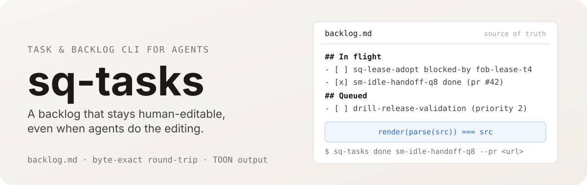

<p align="center">
  
</p>

<h1 align="center">sq-tasks</h1>

<p align="center">
  <a href="https://www.npmjs.com/package/sq-tasks"></a>
  <a href="https://github.com/runecraftai/squad/actions/workflows/ci.yml"></a>
  <a href="https://img.shields.io/badge/platform-macOS%20%7C%20Linux%20%7C%20Windows-blue?style=flat-square"></a>
</p>

<h3 align="center">The operations board agents and humans share.</h3>

Task and backlog manager for agents, part of the [Squad](https://github.com/runecraftai/squad) monorepo.

sq-tasks makes a tiny structured change to a human-readable backlog at near-zero output-token cost.
It edits a hand-editable `backlog.md` in place with a byte-exact round-trip, so the markdown stays the source of truth while long task bodies never bloat a `list`.
It keeps the house style of its siblings: token-efficient TOON output, contextual next-step suggestions, idempotent mutations, and structured errors.

## Why

Every backlog mutation today regenerates markdown through the model, which is expensive output tokens and risks dropped, duplicated, or reordered items.
sq-tasks reduces that to the length of one short command plus a compact confirmation read back as cheap input.
The long status line that the model used to rewrite on every status change is now a `body`.
Note writes are inspect-then-update: read the current body with `show <id> --full`, then replace it deliberately with `update --body` or `update --body-file`.
Pass `--archive-body` with a body replacement when the superseded body should be moved to cold history in `note-archive.md`.

## Quick Start

Install the sq-tasks skill in the [Agent Skills](https://agentskills.io) format with [`npx skills`](https://github.com/vercel-labs/skills):

```sh
npx skills add runecraftai/squad --skill sq-tasks -g
```

That is the entire setup, no npm install needed.
The skill handles discovery; the CLI runs on demand through

```
bin: ~/.local/share/mise/installs/node/26.5.0/bin/sq-tasks
description: "Agent ergonomic task & backlog manager for the current workspace. Prefer this over hand-editing backlog.md for task state, dependency, or hold changes."
in_flight: 0 tasks
queued: 0 tasks
public_followups: 0 obligations
done: 0 retained
help[3]:
- Run `sq-tasks list` for the full backlog
- Run `sq-tasks ready` to see unblocked queued work
- "Run `sq-tasks add <id> "<title>" --start` to add and start a task" (Node 20+ required).
```

Just ask for anything that touches the backlog, filing or dispatching work, completing a task, finding dispatchable or held work, and the agent loads the skill on its own when it recognizes the task.

`-g` installs the skill for all projects; drop it to install for the current project only.

## Other Ways to Install

The skill is the recommended path, but it is not the only one.

### Zero setup

sq-tasks is a plain CLI, so any capable agent can run it directly with nothing installed at all.
Just tell your agent:

```
Execute `npx -y sq-tasks` to manage the backlog.
```

### Session hook

Want the current backlog fed into every agent session as ambient context instead of loading on demand?
Install the CLI globally and opt into the hook:

```sh
npm install -g sq-tasks
sq-tasks setup hooks
```

This installs a `SessionStart` hook for **Claude Code**, **Codex**, and **OpenCode** that surfaces the live backlog at the start of each session.
**Restart your agent session after running this** so the new hook takes effect.

## Usage

Run with no arguments for a content-first dashboard of the current backlog:

```
$ sq-tasks
bin: ~/.local/bin/sq-tasks
description: Agent ergonomic task & backlog manager for the current workspace...
in_flight[1]{id,title,kind,repo}:
  homemux-h7,PERSISTENT XO - owns HomeMux end to end,xo,homemux
summary:
  queued: 14
  ready: 13
queued[10]{id,title,kind,blocked_by}:
  sq-lease-adopt,adopt the durable lease,ship,fob-lease-t4
  ...
done: 10 retained
help[2]:
  - Run `sq-tasks list --state queued` for all 14 queued tasks
  - Run `sq-tasks ready` to see only unblocked work
```

The common mutations are one short, low-token command:

```sh
# add a task (the id is the caller-supplied join key; --mint generates one)
sq-tasks add flow-toggle-q9 "fix summary toggle" --kind ship --repo example-repo --priority 2 --start

# move through the workflow
sq-tasks start sq-lease-adopt
sq-tasks done sm-idle-handoff-q8 --pr https://github.com/owner/repo/pull/42
sq-tasks done fj-task-q1 --pr https://forgejo.example.com/owner/repo/pulls/39
sq-tasks reopen some-task

# dependencies, holds, and the ready queue
sq-tasks block sq-lease-adopt --by fob-lease-t4
sq-tasks hold sq-lease-adopt --reason "commander decision pending" --kind commander
sq-tasks unhold sq-lease-adopt
sq-tasks ready
sq-tasks ready --include-held

# edit the body and title: inspect current notes, then replace the body or title deliberately
sq-tasks show drill-release-validation --full
sq-tasks update drill-release-validation --body "rewritten notes"
sq-tasks update drill-release-validation --body-file notes.md --archive-body
sq-tasks update drill-release-validation --title "clearer title"

# read the full notes on demand (truncated by default)
sq-tasks show homemux-h7 --full

# maintenance
sq-tasks prune --keep 10        # archives the surplus, never deletes
sq-tasks render                 # normalize the markdown in place
sq-tasks mv hibit-cert-cleanup --to ../homemux/data/backlog.md
# move a linked blocker/dependent set together
sq-tasks mv blocker-b1 dependent-d2 --to ../homemux/data/backlog.md
```

Output is [TOON](https://toonformat.dev)-encoded and token-efficient.
The long task body is truncated by default; the whole point is that `list` stays cheap, so use `--full` only when you need the complete notes.
`update --body` and `update --body-file` replace the body wholesale, so agents should inspect the current body first and write back the curated current state rather than appending a journal entry.
`--archive-body` preserves the replaced body in `note-archive.md` using the same dated markdown archive block style as done pruning.
Every write leads with a terse `ok:` line confirming the write result, including the resulting task state when the command changes one (e.g. `ok: start flow-toggle-q9 -> In flight`, `ok: done grok-harness-g7 -> Done (pr <url>)`, `ok: render -> normalized 3`), followed by state-aware next-step hints that never suggest an action the command just performed.
Mutations are idempotent and report what changed (`already: true` on a no-op), so re-running one is safe.
Running `done` again on an already Done task can still backfill a new `--pr`, `--report`, or `--note` without changing the original close date.
`hold <id> --reason "<text>"` records an intentional pause without turning it into prose, and `unhold <id>` clears it.
The reason must be single-line text without parentheses because parentheses are reserved for canonical markdown tags.
Active holds are excluded from `ready`; a hold with `--until YYYY-MM-DD` becomes inactive on and after that date, so the task can surface as ready again if nothing else blocks it.
Use `ready --include-held` to show dispatchable ready work and a separate `held` group with the hold reason, kind, and until date.
Use `list --state held` or `list --fields held,hold_reason,hold_kind,hold_until` when you need to scan active hold state directly.
Pass `--json` to any mutation for a machine-readable result object (`{ "ok": true, "action": …, "task": { … } }` or operation-specific result fields) instead of TOON, so an agent can confirm a write deterministically without a follow-up read.
For `mv`, a single task returns `id`, while a multi-task move returns first-occurrence-ordered, deduplicated `ids`, plus `from` and `to`.

Run `sq-tasks --help` for the command list, or `sq-tasks <command> --help` for per-command usage.

## Durable public follow-ups

A promised public final is a first-class `kind=public-followup` obligation, not a worker task or a `blocked-by` edge.
Create and mutate it only through the dedicated namespace:

```sh
sq-tasks public-followup add public-final-ab \
  --request-context-file request.json \
  --purpose promised-final \
  --expected-final-file expected.json \
  --expires-at 2026-10-01T00:00:00Z \
  --json

sq-tasks public-followup bind-work public-final-ab --relation-file relation.json --json
sq-tasks public-followup supersede-work public-final-ab --relation rel-code --successor-file successor.json --json
sq-tasks public-followup work-event public-final-ab --event-file event.json --json
sq-tasks public-followup list --work-ref xo:demo/work-code-q1 --json
sq-tasks public-followup ready --json
sq-tasks public-followup begin-delivery public-final-ab --payload-hash <sha256> --json
sq-tasks public-followup record-error public-final-ab --error-file error.json --json
sq-tasks public-followup record-delivery public-final-ab --receipt-file receipt.json --json
```

The request context file contains the relay-issued request id, platform, opaque `ctx1` binding, bounded public-safe summary, received time, follow-up expiry, and reservation expiry.
The expected-final file defines its typed outcome, stable project, required deliverable names, and `all-required` or `any-required` completion policy.
Relation files contain a stable `relation_id`, `{home_id, task_id}` work reference, `fulfills` or `contributes` role, required flag, and generation.
Completion event files use schema version 1 and bind an event id, obligation id, relation id, generation, source home, work id, typed outcome, safe deliverables, bounded public-safe outcome, and a `successor` field that is null unless the outcome supersedes the relation.
A posted receipt file records `state=posted`, request id, platform, attempt and chunk counts, posted time, and optional retention time.
Its attempt count must exactly match the currently recorded delivery attempt, including late receipts that reconcile that same attempt from `unknown` or `partial`.
An error file records the current attempt count, a safe delivery state, validated error code, occurrence time, optional retry time, and optional chunk counts.
Its attempt count must exactly match the currently recorded delivery attempt, and stale or future-attempt errors fail without mutation.
Expected-final types permit only their matching safe deliverables: `pr_url`, `report_path`, `commit_sha`, or `error_code`.
Run `sq-tasks public-followup --help` for the exact file-backed command surface and state names.

Each mutation is idempotent and returns the monotonic obligation `revision`, changed fields, and complete typed payload under `--json`.
Duplicate accepted event ids are no-ops, while conflicting ids, stale generations, source mismatches, malformed typed data, and changed immutable intake fields fail closed.
One work item can relate to several obligations, and one obligation can require work from several homes.
These cross-home relations are separate from same-backlog dispatch dependencies.
Existing same-backlog `blocked-by` edges remain delivery gates for `ready` and `begin-delivery`.

`sq-tasks ready` excludes public obligations from its ordinary `ready` worker group and exposes delivery-ready obligations only in `ready_public_followups`.
Use `sq-tasks public-followup ready` when handling public delivery.
Generic `start`, `done`, `reopen`, active removal, content or kind changes, and dispatch holds cannot bypass the public-followup state machine.
Only `record-delivery` with a validated terminal `posted` receipt or `waive --approved-by commander` can atomically move an obligation to Done.
Normal Done pruning then preserves the complete typed receipt or waiver in `done-archive.md`.

The Markdown backend stores version 1 typed data in a reserved base64url canonical-JSON HTML comment immediately below the task bullet.
The bounded public-safe title and `(kind: public-followup)` remain visible, but callers other than sq-tasks must not parse or rewrite the reserved comment.
Generic title and body updates are refused because changing the immutable public promise requires a successor obligation.
The typed schema permits public-safe identifiers, summaries, deliverables, receipt counters, timestamps, and validated error codes.
It rejects unknown fields so raw request text, parent context, author or channel ids, signed URLs, and raw platform responses cannot silently enter machine-readable output.

## The markdown backend

`backlog.md` stays the hand-editable source of truth.
sq-tasks parses it leniently into a model, mutates the targeted item, and re-renders **in place** with a byte-exact round-trip on a file nobody has changed: `render(parse(src)) === src`.
Targeted task mutations re-render only the affected task; every other line, including free-form (no-id) notes, is preserved verbatim.
An item's body includes every following indented or blank line, so multi-paragraph notes and indented Markdown content move intact with the task.
Trailing separator blanks remain with the item's raw source for byte-exact preservation without becoming part of its structured body.
Maintenance commands are explicit exceptions: `render` normalizes every recognized task, `prune` trims the chosen section into the archive, and `mv` writes both source and destination backlogs.
`mv <id> [<id>...] --to <path-or-dir>` moves one or more tasks as one atomic cross-file transaction.
To move a dependency-connected set, include every linked blocker and active dependent in the same command, unless the other endpoint already exists in the destination backlog.
The command refuses a move that would strand a dependency across the two files, while preserving intra-set `blocked-by` links and their reason strings.
Moved tasks are re-rendered canonically, so their multi-paragraph bodies remain intact but a trailing blank separator before the next item or section is dropped.

The read-modify-write window is guarded by an advisory lockfile, an atomic write (temp file + rename), and a fresh re-read on every invocation, so a hand-edit and a CLI-edit cannot clobber each other.
Task state is carried by the section header, not by the bullet style: `## In flight`, `## Queued`, and `## Done` decide whether a recognized item is in flight, queued, or done.
In flight parses both the legacy `- **id** - ...` form and the `- [ ] id - ...` checkbox form, while normalization renders both In flight and Queued items as `- [ ] id - ...` and Done items as `- [x] id - ...`.
Untouched legacy lines are still preserved byte-for-byte; only mutated or explicitly normalized tasks are rewritten.

It gently formalizes the inline tags a backlog already uses as the canonical fields:

- `(repo: X)` - the repo a task belongs to
- `blocked-by: <id>` or `blocked-by: <id> - <reason>` - a dependency edge, optionally with preserved free-text rationale (also `parent:` / `discovered-from:`)
- `(since <date>)` - when a task started; `(merged <date>)` / `(reported <date>)` when it closed
- `(kind: X)` - task kind, when not already implied by a leading `SHIP` / `SCOUT` / `DOCS-ONLY` / `PERSISTENT XO` word
- `(priority: 0-4)` - optional priority, also accepted through `add` / `update --priority`
- `(hold: <reason>)`, `(hold-kind: commander|external|load|parked|future)`, `(hold-until: YYYY-MM-DD)` - structured dispatch holds written by `hold`
- PR urls, `data/<id>/report.md` paths, and other `http(s)` urls - typed links

`sq-tasks render` rewrites every id'd task into this canonical form; free-form lines are left untouched.
Bare dependency edges render immediately after the title, while reason-bearing dependency edges render after the parenthetical tags so the reason stays attached to the edge on the next parse.
Dependency reasons are preserved metadata only; readiness still keys off the blocker id.
Hold reasons are preserved metadata too, but active holds are a readiness gate until cleared or until their date gate expires.
Existing prose markers like `HELD`, `PARKED`, `DEFERRED`, `COMMANDER-DECISION`, and `do not dispatch` stay prose until you intentionally migrate them.
Map them to structured holds by preserving the original prose as the reason and choosing `commander`, `parked`, `future`, `load`, or `external` only when the text supports that bucket.
Do not bulk-rewrite live backlogs just to chase these tags; migrate only when touching the task or when a hold migration specifically targets them.
`add --blocked-by` and `block --by` require the referenced task to exist, and `rm` refuses to remove a task that still blocks active work.
Single-task `mv` has the same protection; use multi-task `mv` to move its active dependents with it.

## Configuration

Backend and path are resolved in this order: `--backend` / `--file` flags passed after the command, then `SQ_TASKS_BACKEND` / `SQ_TASKS_FILE` env, then a project `.tasks.toml`, then `~/.sq-tasks/config.toml`, then the defaults.
Without an explicit path, sq-tasks uses `backlog.md` when present, then `data/backlog.md` when present, and otherwise targets `backlog.md` for future writes.

```toml
# .tasks.toml in the project root
backend = "markdown"

[markdown]
path = "data/backlog.md"
archive = "data/done-archive.md"
done_keep = 10
```

`archive` is optional; when omitted, pruned tasks are appended to `done-archive.md` next to the active backlog.
Body replacements with `--archive-body` append superseded bodies to `note-archive.md` next to the active backlog.

## Backends

The current release ships the **markdown** backend only, behind a narrow `Store` interface so additional backends slot in without touching the CLI layer.

| Backend                | Status  |
| ---------------------- | ------- |
| markdown               | shipped |
| sqlite                 | planned |
| github / jira / linear | planned |

## Development

```sh
pnpm install
pnpm build         # tsc -> dist/
pnpm test          # vitest
pnpm lint          # eslint
pnpm run build:skill -- --check   # fail if the generated skill is stale
```

The installable skill is generated from the same description and help the CLI prints, so it can never drift.

## Contributing

Contributions are welcome.
Human-authored PRs targeting `main` are raised through the [`drill`](https://github.com/runecraftai/squad) gate, which runs review/test/lint/CI before opening the PR.
See [CONTRIBUTING.md](CONTRIBUTING.md) for the full workflow and repo conventions.

## License

[MIT](LICENSE) © Squad contributors
